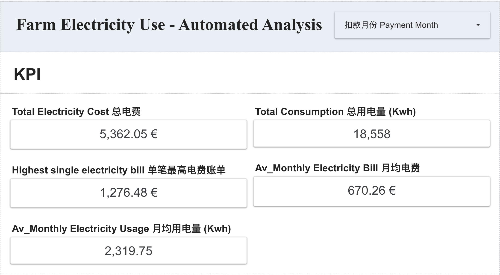
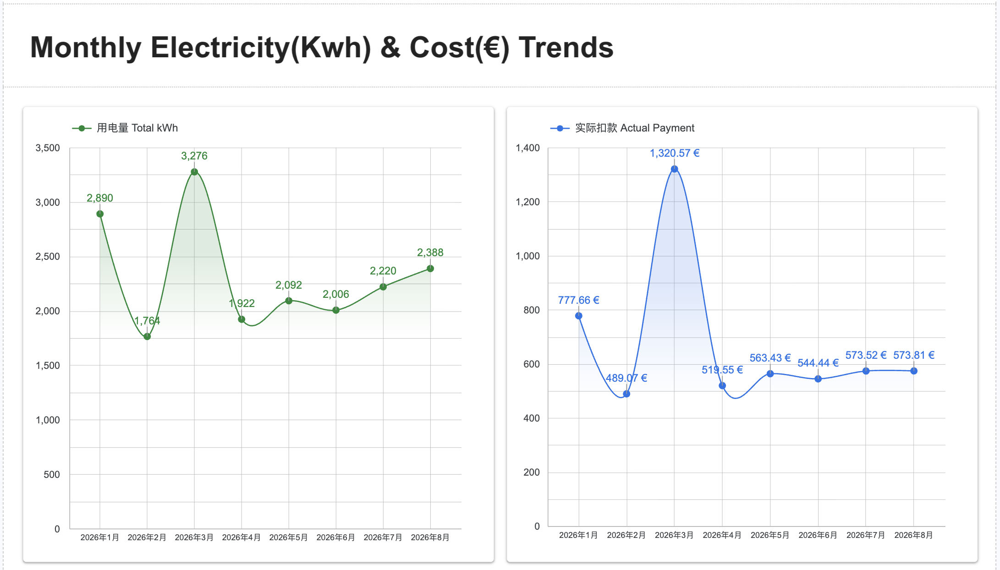
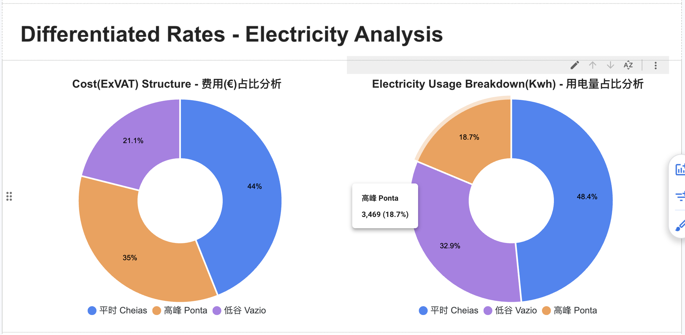
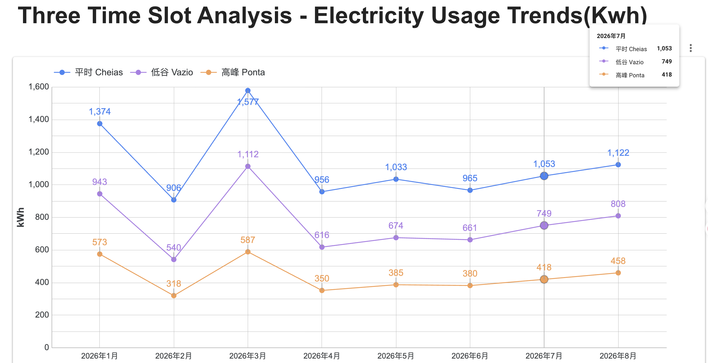
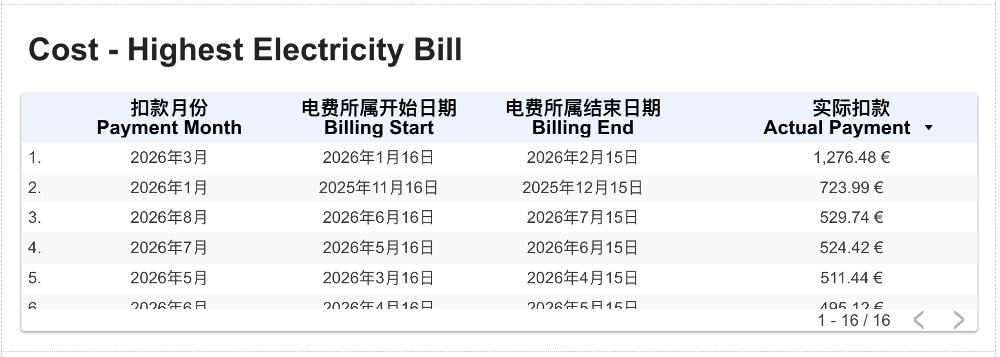

# Farm Energy Consumption Analysis

A data visualization project analyzing farm electricity consumption, energy costs, tariff patterns, and monthly usage trends using Google Sheets and Looker Studio.

The original dataset contains private operational and financial information and is therefore not publicly shared.

## Project Overview

This project was developed to transform raw electricity billing records into a structured and interactive dashboard for monitoring energy consumption and costs.

The analysis focuses on:

- Monthly electricity consumption and cost trends
- Electricity usage under different tariff periods
- Cost distribution across tariff periods
- Identification of high-cost billing periods
- Interactive filtering by payment month

## Data Preparation

The source data was organized and prepared in Google Sheets before being connected to Looker Studio.

The dataset includes:

- Payment month and payment date
- Billing period
- Tariff type
- Time slot
- Electricity consumption (kWh)
- Unit electricity price
- Energy cost
- Actual payment amount

The original dataset contains private operational and financial information and is therefore not publicly shared.

## Tools

- Google Sheets — Data preparation and transformation
- Looker Studio — Interactive dashboard and data visualization
- Data Analysis — KPI analysis, trend analysis and tariff comparison

## Dashboard

The dashboard provides an overview of electricity consumption and energy costs, including:

- Total electricity cost
- Total electricity consumption
- Average monthly electricity cost
- Average monthly electricity consumption
- Monthly consumption trends
- Monthly electricity cost trends
- Tariff-based cost and consumption analysis
- Time-slot electricity consumption analysis
- Highest electricity bill records

### Dashboard Overview



### Monthly Electricity Cost and Consumption Trends



### Tariff Analysis



### Time Slot Analysis



### Highest Electricity Bill



## Key Analysis Areas

### 1. Monthly Trends

Analyzed changes in electricity consumption and electricity costs across different billing months to identify periods with higher energy usage and expenses.

### 2. Tariff Analysis

Compared electricity consumption and energy costs across different tariff periods to understand how electricity usage is distributed across pricing categories.

### 3. Time Slot Analysis

Analyzed electricity consumption during different time slots, providing a clearer view of usage patterns and potential opportunities for better energy management.

### 4. Cost Monitoring

Developed KPI indicators and ranking views to identify high-cost billing periods and support ongoing electricity cost monitoring.

## Project Structure

```text
Farm-Energy-Consumption-Analysis/
│
├── dashboard/
│   └── README.md
│
├── screenshots/
│   ├── 01_dashboard_overview.jpg
│   ├── 02_monthly_electricity_cost_trends.jpg
│   ├── 03_tariff_analysis.jpg
│   ├── 04_time_slot_analysis.jpg
│   ├── 05_highest_electricity_bill.jpg
│   └── README.md
│
└── README.md
